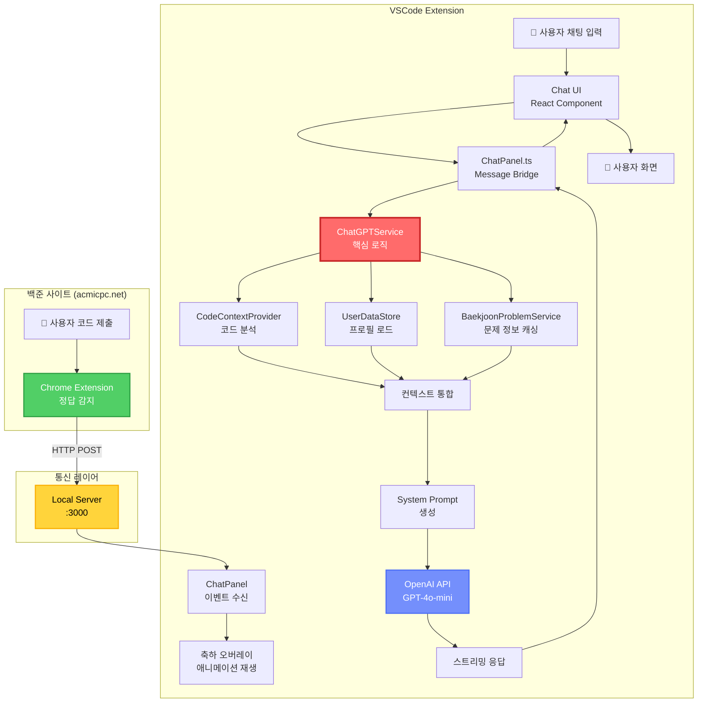

# Anime Girlfriend - BOJ Companion

> **AI 기반 백준 코딩 어시스턴트 with 애니메이션 캐릭터**

[](https://code.visualstudio.com/)
[](https://www.typescriptlang.org/)
[](https://openai.com/)
[](https://www.google.com/chrome/)

---

## 📌 프로젝트 개요

**Anime Girlfriend**는 백준 온라인 저지(BOJ) 문제 풀이를 지원하는 AI 기반 VSCode Extension + Chrome Extension 통합 시스템입니다. 애니메이션 캐릭터(Aru/Chihiro)가 코딩 과정에서 실시간으로 대화하며 힌트를 제공하고, 백준 사이트에서 정답을 맞추면 자동으로 축하 애니메이션을 보여줍니다.

### 🎯 핵심 기능

- 🤖 **AI 채팅 인터페이스** - OpenAI GPT-4o 기반 실시간 스트리밍 대화
- 🎨 **애니메이션 캐릭터** - Aru(테크 긱 소녀) / Chihiro(차분한 멘토) 선택 가능
- 💡 **단계적 힌트 시스템** - 문제별 3단계 힌트 제공 (스포일러 방지)
- 🔍 **코드 컨텍스트 인식** - 현재 작성 중인 코드 자동 분석 및 오류 진단
- 🎉 **정답 감지 시스템** - Chrome Extension으로 백준 정답 여부 실시간 모니터링
- 🧠 **성격 분석 온보딩** - Chain-of-Density 기반 사용자 성격 프로파일링
- ⚡ **실시간 코딩 상태** - 타이핑, 디버깅, 아이들 상태별 애니메이션 변화

---

## 🏗️ 서비스 아키텍처

### 전체 시스템 구조



---

## 🔄 주요 파이프라인

### 1. 백준 정답 감지 → 축하 플로우

```
[백준 사이트]
   ↓ 사용자가 코드 제출
[Chrome Extension - content.js]
   ├─ MutationObserver로 채점 테이블 감시
   ├─ "맞았습니다!!" 텍스트 감지
   ↓
[HTTP POST → localhost:3000/boj-success]
   payload: { problemId, status: "accepted" }
   ↓
[VSCode Extension - LocalServer]
   ├─ POST 요청 수신
   ├─ ChatPanel.showOverlay(problemId) 호출
   ↓
[Webview - 축하 오버레이]
   ├─ arusolved.mp4 또는 chihirosolve.mp4 재생
   ├─ 3초 후 자동 닫힘
   └─ Solved.ac 프로필 자동 갱신
```

### 2. AI 채팅 응답 생성 파이프라인

```
[사용자 입력] "1149번 힌트 줘"
   ↓
[ChatGPTService.sendMessage()]
   │
   ├─→ [1단계] 컨텍스트 수집
   │      ├─ CodeContextProvider → 현재 파일 정보, 에러 진단
   │      ├─ BaekjoonProblemService → 문제 설명 (solved.ac API)
   │      ├─ UserDataStore → 사용자 프로필 (성격 분석, 코어 메모리)
   │      └─ 현재 힌트 레벨 확인 (0→1→2→3)
   │
   ├─→ [2단계] System Prompt 생성
   │      ├─ CHARACTER PROFILE (Aru/Chihiro 캐릭터 설정)
   │      ├─ USER ANALYSIS (사용자 성격 분석)
   │      ├─ CORE MEMORIES (5가지 공유 기억)
   │      ├─ PROBLEM CONTEXT (문제 정보 + 현재 힌트 레벨)
   │      └─ CODE CONTEXT (현재 코드 상태)
   │
   ├─→ [3단계] OpenAI API 호출
   │      ├─ Model: gpt-4o-mini (텍스트) / gpt-4o (이미지)
   │      ├─ Stream: true (Server-Sent Events)
   │      └─ Temperature: 0.7
   │
   └─→ [4단계] 스트리밍 응답
          ├─ onToken → 토큰 단위로 UI 업데이트
          ├─ onComplete → 대화 히스토리 저장
          └─ 힌트 레벨 업데이트 (0→1→2→3)
```

### 3. 온보딩 파이프라인 (Chain-of-Density)

```
[1단계] 캐릭터 선택
   └─ Aru (테크 긱 소녀) / Chihiro (차분한 멘토)

[2단계] Solved.ac 핸들 입력
   ├─ solved.ac API로 프로필 조회
   └─ 솔브드 티어, 문제 수, 레이팅 저장

[3단계] 성격 분석 설문
   ├─ 4가지 에세이 질문
   │   - selfIntro: "자신을 소개해주세요"
   │   - futureVision: "1년 후 어떤 모습인가요?"
   │   - stressStrategy: "스트레스 받을 때 어떻게 하나요?"
   │   - happiness: "무엇이 당신을 행복하게 하나요?"
   │
   └─→ [GPT-4o로 Chain-of-Density 분석]
          Input: 4가지 에세이
          Output: 3문장 초밀집 성격 분석
          Example: "당신은 목표 지향적이며 체계적인 학습을 선호합니다.
                   스트레스 상황에서는 문제 해결에 집중하며...
                   성취감과 성장이 핵심 동기입니다."

[4단계] 코어 메모리 생성
   ├─→ [GPT-4o로 5가지 공유 기억 생성]
   │      Input: 성격 분석 + 에세이 + 캐릭터 프로필
   │      Output: 캐릭터와 사용자의 5가지 공유 기억
   │      Example:
   │        1. "처음 만난 날, 네가 알고리즘을 어려워하길래..."
   │        2. "함께 다이나믹 프로그래밍을 공부하던 날..."
   │        3. "네가 처음으로 골드 티어를 달성했을 때..."
   │
   └─ UserProfile 저장 (GlobalState)
```

---

## 🧩 핵심 컴포넌트

### 1. Chrome Extension - 백준 정답 감지기

#### 작동 원리
```javascript
// content.js - 백준 채점 결과 페이지 모니터링
const observer = new MutationObserver(() => {
    const submissionRows = document.querySelectorAll('table#status-table tr');

    for (const row of submissionRows) {
        const resultCell = row.querySelector('td.result');
        const resultText = resultCell?.innerText.trim();

        if (resultText.includes('맞았습니다')) {
            // 문제 번호 추출
            const problemId = row.querySelector('a[href^="/problem/"]').innerText;

            // VSCode Extension으로 전송
            fetch('http://localhost:3000/boj-success', {
                method: 'POST',
                headers: { 'Content-Type': 'application/json' },
                body: JSON.stringify({
                    problemId,
                    status: 'accepted',
                    memory: '2024 KB',
                    time: '32 ms'
                })
            });

            // 축하 오버레이 표시 (백준 페이지 내)
            showCelebrationOverlay(problemId);
        }
    }
});

observer.observe(document.body, { childList: true, subtree: true });
```

#### 기능
- ✅ 채점 결과 실시간 모니터링 (MutationObserver)
- ✅ 정답/오답/시간초과 등 상태 분류
- ✅ VSCode Extension으로 HTTP POST 전송
- ✅ 백준 페이지 내 축하 비디오 재생 (arusolved.mp4 / chihirosolve.mp4)

---

### 2. VSCode Extension - AI 채팅 시스템

#### 코드 컨텍스트 수집
```typescript
// CodeContextProvider.ts
class CodeContextProvider {
    buildContextString(): string {
        const editor = vscode.window.activeTextEditor;
        if (!editor) return '';

        const document = editor.document;
        const diagnostics = vscode.languages.getDiagnostics(document.uri);

        // 현재 파일 정보
        const fileName = path.basename(document.fileName);
        const language = document.languageId;
        const selectedText = document.getText(editor.selection);

        // 에러/경고 정보
        const errors = diagnostics.filter(d => d.severity === 0);
        const warnings = diagnostics.filter(d => d.severity === 1);

        // 코드 내용 (최대 100줄)
        const lines = document.getText().split('\n').slice(0, 100);

        return `
## Currently Editing
**File:** ${fileName}
**Language:** ${language}

### Diagnostics
${errors.map(e => `- Line ${e.range.start.line + 1}: [ERROR] ${e.message}`).join('\n')}

### Code (first 100 lines)
\`\`\`${language}
${lines.join('\n')}
\`\`\`
        `;
    }
}
```

#### System Prompt 구조
```typescript
function buildSystemPrompt(): string {
    return `
### CHARACTER PROFILE
${character === 'aru' ? ARU_PROFILE : CHIHIRO_PROFILE}

### INSTRUCTIONS
- 항상 캐릭터의 톤과 말투를 유지하세요
- 한국어로 대화하세요
- 힌트는 단계적으로 제공하세요 (레벨 0→1→2→3)
- 코드를 직접 작성하지 마세요, 사고 과정을 유도하세요

### USER ANALYSIS
${userProfile.analysis}
(Chain-of-Density로 생성된 3문장 성격 분석)

### SHARED MEMORIES
${userProfile.coreMemories.sharedMemories.map((m, i) => `${i+1}. ${m}`).join('\n')}

### PROBLEM CONTEXT
문제 번호: ${problemId}
현재 힌트 레벨: ${currentHintLevel}/3
${problemDescription}

### CURRENT CODE CONTEXT
${codeContextProvider.buildContextString()}
    `;
}
```

---

### 3. Local Server - 통신 브리지

#### 구현
```typescript
// LocalServer.ts
class LocalServer {
    private server: http.Server;

    constructor(port: number, onSuccess: (data) => void) {
        this.server = http.createServer((req, res) => {
            if (req.method === 'POST' && req.url === '/boj-success') {
                let body = '';
                req.on('data', chunk => body += chunk);
                req.on('end', () => {
                    const data = JSON.parse(body);
                    console.log('[LocalServer] BOJ Success:', data);

                    // ChatPanel로 이벤트 전달
                    onSuccess(data);

                    res.writeHead(200);
                    res.end('OK');
                });
            }
        });

        this.server.listen(port, () => {
            console.log(`[LocalServer] Listening on :${port}`);
        });
    }
}
```

---

### 4. 문제 정보 캐싱 시스템

#### 동작 방식
```typescript
// BaekjoonProblemService.ts
class BaekjoonProblemService {
    async getProblemInfo(problemId: string): Promise<ProblemInfo> {
        // 1. 캐시 확인
        const cached = this.userDataStore.getCachedProblem(problemId);
        if (cached) return cached;

        // 2. solved.ac API 호출
        const response = await fetch(
            `https://solved.ac/api/v3/problem/show?problemId=${problemId}`
        );
        const data = await response.json();

        // 3. GPT-4o로 문제 설명 요약 (한국어)
        const summary = await this.summarizeProblem(data.titleKo, data.tags);

        // 4. 솔루션 전략 생성 (XML 포맷)
        const solutionStrategy = await this.generateSolutionStrategy(data);

        // 5. 캐시 저장
        const problemInfo = {
            problemId,
            title: data.titleKo,
            tags: data.tags.map(t => t.displayNames[0].name),
            problemDescription: summary,
            solutionSummary: solutionStrategy,
            cachedAt: new Date().toISOString()
        };

        this.userDataStore.setCachedProblem(problemId, problemInfo);
        return problemInfo;
    }
}
```

#### 솔루션 전략 XML 포맷
```xml
<solution_summary>
  <hint_level_1>
    이 문제는 다이나믹 프로그래밍으로 접근할 수 있습니다.
    각 집의 색상 선택이 이전 선택에 영향을 받는다는 점을 고려하세요.
  </hint_level_1>

  <hint_level_2>
    dp[i][j] = i번째 집을 j색으로 칠할 때 최소 비용
    점화식: dp[i][j] = cost[i][j] + min(dp[i-1][k]) (k != j)
  </hint_level_2>

  <hint_level_3>
    초기값: dp[0][0/1/2] = cost[0][0/1/2]
    반복: i = 1 to N-1
    답: min(dp[N-1][0], dp[N-1][1], dp[N-1][2])
  </hint_level_3>
</solution_summary>
```

---

## 🛠️ 기술 스택

### Frontend
- **UI Framework**: React 18.2 (TypeScript)
- **상태 관리**: React Hooks (useState, useEffect)
- **스타일링**: Custom CSS with VSCode Webview API
- **번들러**: esbuild (빠른 빌드)

### Backend
- **런타임**: Node.js 18+
- **Extension API**: VSCode Extension API
- **HTTP 통신**: node-fetch 2.7
- **타입 안정성**: TypeScript 5.0

### AI/ML
| 컴포넌트 | 기술 | 버전 |
|---------|------|------|
| **LLM** | OpenAI GPT-4o / GPT-4o-mini | Latest |
| **성격 분석** | Chain-of-Density (CoD) | GPT-4o |
| **문제 요약** | GPT-4o-mini | Latest |

### Browser Extension
- **Manifest Version**: 3
- **타겟 브라우저**: Chrome, Edge
- **권한**: storage, host_permissions (acmicpc.net)

### DevOps
- **패키징**: VSCode Extension Packaging (vsce)
- **버전 관리**: Git (monorepo)

---

## 📦 설치 및 실행

### 사전 준비
```bash
# 필수 요구사항
- Node.js 18+
- VSCode 1.74.0+
- Chrome / Edge 브라우저
- OpenAI API Key
```

### 1. 저장소 클론 및 설치
```bash
git clone <repository-url>
cd anime-girlfriend
npm install
```

### 2. VSCode Extension 빌드
```bash
cd packages/vscode-extension
npm run compile

# VSCode에서 F5 키로 Extension Development Host 실행
```

### 3. Chrome Extension 설치
```bash
1. Chrome 브라우저에서 chrome://extensions/ 접속
2. "개발자 모드" 활성화
3. "압축 해제된 확장 프로그램 로드" 클릭
4. packages/chrome-extension 폴더 선택
```

### 4. OpenAI API Key 설정
```
1. VSCode에서 Ctrl+Shift+P (Command Palette)
2. "Anime Girlfriend: Enter OpenAI API Key" 실행
3. API 키 입력
4. VSCode Secret Storage에 암호화 저장됨
```

### 5. 온보딩 완료
```
1. VSCode 좌측 Activity Bar에서 Anime Girlfriend 아이콘 클릭
2. 캐릭터 선택 (Aru / Chihiro)
3. Solved.ac 핸들 입력
4. 성격 분석 설문 작성 (4가지 에세이)
5. AI가 자동으로 성격 분석 + 공유 기억 생성
```

---

## 🎮 사용법

### 기본 채팅
```
1. VSCode에서 Anime Girlfriend 패널 열기
2. 채팅 입력창에 질문 입력
3. 실시간 스트리밍 응답 확인

예시:
- "안녕!"
- "1149번 문제 어떻게 풀어?"
- "이 코드 뭐가 틀렸어?"
```

### 단계적 힌트 요청
```
User: "1149번 힌트 줘"
AI: [힌트 레벨 1] 이 문제는 다이나믹 프로그래밍입니다...

User: "더 자세히 알려줘"
AI: [힌트 레벨 2] dp[i][j] = i번째 집을 j색으로...

User: "아직도 모르겠어"
AI: [힌트 레벨 3] 초기값은... 점화식은...
```

### 코드 디버깅
```
1. VSCode에서 코드 작성
2. 컴파일 에러 발생 시 자동으로 에러 정보 수집
3. 채팅에서 "이 에러 뭐야?" 질문
4. AI가 현재 코드 + 에러 메시지 분석 후 답변
```

### 백준 정답 축하
```
1. 백준 사이트에서 코드 제출
2. "맞았습니다!!" 결과 확인
3. 자동으로 VSCode에서 축하 오버레이 재생
4. Solved.ac 프로필 자동 갱신
```

---

## 📊 프로젝트 구조

```
anime-girlfriend/
├── packages/
│   ├── vscode-extension/          # VSCode Extension
│   │   ├── src/
│   │   │   ├── extension.ts       # Extension 진입점
│   │   │   ├── ChatPanel.ts       # Webview 관리
│   │   │   ├── ChatGPTService.ts  # AI 서비스 핵심 로직
│   │   │   ├── LocalServer.ts     # HTTP 서버 (:3000)
│   │   │   ├── CodeContextProvider.ts  # 코드 분석
│   │   │   ├── UserDataStore.ts        # 프로필 저장
│   │   │   │
│   │   │   ├── services/
│   │   │   │   ├── BaekjoonProblemService.ts  # 문제 정보 캐싱
│   │   │   │   ├── SolvedAcService.ts         # solved.ac API
│   │   │   │   ├── ContextAggregator.ts       # 컨텍스트 통합
│   │   │   │   ├── StrategyAgent.ts           # 전략 생성
│   │   │   │   └── PersonaWrapper.ts          # 페르소나 래퍼
│   │   │   │
│   │   │   ├── webview/
│   │   │   │   ├── components/
│   │   │   │   │   └── Chat.tsx               # React 채팅 UI
│   │   │   │   └── personality/
│   │   │   │       ├── promptEngine.ts        # CoD 프롬프트
│   │   │   │       ├── questions.ts           # 설문 질문
│   │   │   │       └── scoring.ts             # 성격 점수화
│   │   │   │
│   │   │   └── characters/
│   │   │       ├── aru/                       # Aru 캐릭터
│   │   │       │   ├── profile.ts
│   │   │       │   ├── messages.ts
│   │   │       │   └── config.ts
│   │   │       └── chihiro/                   # Chihiro 캐릭터
│   │   │           ├── profile.ts
│   │   │           ├── messages.ts
│   │   │           └── config.ts
│   │   │
│   │   └── package.json
│   │
│   └── chrome-extension/           # Chrome Extension
│       ├── content.js              # 백준 페이지 모니터링
│       ├── manifest.json           # Extension 설정
│       ├── public/
│       │   ├── arusolved.mp4       # Aru 축하 비디오
│       │   └── chihirosolve.mp4    # Chihiro 축하 비디오
│       └── test-overlay.html       # 테스트 페이지
│
├── docker-compose.yml              # PostgreSQL (선택 사항)
├── CHAT_PIPELINE.md                # 채팅 플로우 문서
├── RAG_ARCHITECTURE.md             # RAG 시스템 문서 (미사용)
└── README.md                       # 이 파일
```

---

## 🔬 기술 세부사항

### Chain-of-Density (CoD) 성격 분석

#### 프롬프트 구조
```typescript
// webview/personality/promptEngine.ts
function generateCoDPrompt(essays: UserEssays): string {
    return `
당신은 사용자의 에세이를 분석하여 밀도 높은 성격 분석을 생성하는 전문가입니다.

**사용자 에세이:**
1. 자기소개: ${essays.selfIntro}
2. 1년 후 모습: ${essays.futureVision}
3. 스트레스 대처: ${essays.stressStrategy}
4. 행복의 원천: ${essays.happiness}

**분석 요구사항:**
- 정확히 3문장으로 작성하세요
- 각 문장은 사용자의 핵심 특성을 담아야 합니다
- 학습 스타일, 동기, 성격 특성을 포함하세요
- 구체적이고 실용적인 표현을 사용하세요

**출력 형식:**
3문장의 분석 결과만 작성하세요 (불필요한 서론/결론 없이)
    `;
}
```

#### 생성 결과 예시
```
당신은 목표 지향적이며 체계적인 학습을 선호하는 개발자입니다.
스트레스 상황에서는 문제 해결에 집중하며 단계별 접근을 통해 극복합니다.
성취감과 지속적인 성장이 당신의 핵심 동기이며, 도전적인 과제에서 에너지를 얻습니다.
```

---

### 공유 기억 생성 (Shared Memories)

#### 프롬프트 구조
```typescript
function generateCoreMemoriesPrompt(
    character: Character,
    analysis: string,
    essays: UserEssays
): string {
    return `
당신은 ${character === 'aru' ? 'Aru' : 'Chihiro'}입니다.

**사용자 성격 분석:**
${analysis}

**캐릭터 프로필:**
${character === 'aru' ? ARU_PROFILE : CHIHIRO_PROFILE}

**임무:**
사용자와 당신(캐릭터)이 함께 겪었던 5가지 의미 있는 기억을 생성하세요.

**기억 생성 규칙:**
1. 각 기억은 1-2문장으로 작성
2. 사용자의 성격 특성을 반영
3. 코딩/학습과 관련된 순간
4. 감정적 연결이 느껴지도록
5. 캐릭터의 말투와 톤 유지

**출력 형식 (JSON):**
{
  "sharedMemories": [
    "기억 1...",
    "기억 2...",
    "기억 3...",
    "기억 4...",
    "기억 5..."
  ]
}
    `;
}
```

#### 생성 결과 예시 (Aru 캐릭터)
```json
{
  "sharedMemories": [
    "처음 만난 날, 네가 알고리즘을 어려워하길래 내가 비유를 들어서 설명해줬잖아. 그때 네 눈이 반짝이던 거 기억나!",
    "함께 다이나믹 프로그래밍 문제를 3시간 동안 붙잡고 있었는데, 결국 풀었을 때 우리 둘 다 소리쳤었지. 완전 짜릿했어!",
    "네가 처음으로 골드 티어를 달성했을 때, 내가 케이크 이모티콘 보내줬던 거 기억해? ㅋㅋㅋ 그때 진짜 자랑스러웠어.",
    "늦은 밤까지 디버깅하다가 오타 하나 때문에 틀렸던 적 있잖아. 그때 내가 '실수도 배움이야!'라고 위로해줬었지.",
    "네가 백준 스트릭 100일 달성했을 때, 우리 둘이 가상으로 하이파이브 했던 그 순간. 너의 꾸준함이 정말 멋졌어!"
  ]
}
```

---

### 코딩 상태 감지 시스템

#### 상태 분류
```typescript
type CodingState =
    | 'idle'       // 아무것도 안 함
    | 'typing'     // 타이핑 중
    | 'debugging'  // 에러가 있음
    | 'running';   // 코드 실행 중

function getCodingState(): CodingStateInfo {
    const editor = vscode.window.activeTextEditor;
    if (!editor) return { state: 'idle', codeLength: 0, hasErrors: false };

    const document = editor.document;
    const diagnostics = vscode.languages.getDiagnostics(document.uri);
    const errors = diagnostics.filter(d => d.severity === 0);

    return {
        state: errors.length > 0 ? 'debugging' : 'typing',
        codeLength: document.getText().length,
        hasErrors: errors.length > 0,
        hasWarnings: diagnostics.length > errors.length
    };
}
```

#### UI 애니메이션 매핑
```javascript
// Chat.tsx
const getCharacterAnimation = (codingState) => {
    switch (codingState) {
        case 'idle':
            return 'idle.gif';      // 가만히 있는 모습
        case 'typing':
            return 'typing.gif';    // 타이핑 애니메이션
        case 'debugging':
            return 'debugging.gif'; // 걱정스러운 표정
        case 'running':
            return 'running.gif';   // 기대하는 모습
    }
};
```

---

## 🚀 향후 개선 계획

### 기능 추가
- [ ] **여러 캐릭터 추가** - 다양한 페르소나 선택지
- [ ] **음성 TTS** - 캐릭터 목소리로 응답 읽어주기
- [ ] **문제 추천 시스템** - 사용자 레벨 기반 맞춤 문제 추천
- [ ] **학습 통계 대시보드** - 일일/주간 학습 리포트
- [ ] **Discord 연동** - 친구들과 진행 상황 공유

### 기술 개선
- [ ] **RAG 시스템 활성화** - PostgreSQL + pgvector (선택적)
- [ ] **로컬 LLM 지원** - Ollama 통합으로 API 비용 절감
- [ ] **문제 풀이 코드 저장** - 자동으로 Git 커밋
- [ ] **성능 최적화** - 응답 캐싱, 프롬프트 압축

---

## 🐛 디버깅 및 테스트

### VSCode 디버그 명령어
```
Command Palette (Ctrl+Shift+P)
  ├─ Anime Girlfriend: Show Chat                    - 채팅 패널 열기
  ├─ Anime Girlfriend: Enter OpenAI API Key         - API 키 설정
  ├─ Anime Girlfriend: Reset Profile                - 프로필 초기화
  ├─ Anime Girlfriend: Debug: Show Stored Profile   - 프로필 JSON 보기
  ├─ Anime Girlfriend: Debug: Show Current Code Context  - 코드 컨텍스트 확인
  ├─ Anime Girlfriend: Clear Problem Cache          - 문제 캐시 삭제
  └─ Anime Girlfriend: Debug: Show All Storage      - 전체 스토리지 보기
```

### Chrome Extension 디버깅
```
1. Chrome 브라우저에서 백준 사이트 접속
2. F12 (개발자 도구) 열기
3. Console 탭에서 로그 확인
4. "[BOJ-GF] ..." 메시지 확인
```

### LocalServer 상태 확인
```bash
# Extension이 실행 중일 때 터미널에서:
curl http://localhost:3000/health

# 응답: "OK" (서버 정상 작동)
```

---

## 📚 참고 문서

- **[CHAT_PIPELINE.md](./CHAT_PIPELINE.md)** - 채팅 응답 생성 파이프라인 상세 설명
- **[RAG_ARCHITECTURE.md](./RAG_ARCHITECTURE.md)** - RAG 시스템 아키텍처 (선택적 기능)
- **[OpenAI API Documentation](https://platform.openai.com/docs)** - GPT API 공식 문서
- **[VSCode Extension API](https://code.visualstudio.com/api)** - VSCode Extension 개발 가이드
- **[solved.ac API](https://solvedac.github.io/unofficial-documentation/)** - 백준 문제 메타데이터 API

---

## 📄 라이선스

MIT License

---

## 👥 팀 소개

**프로젝트 리드**: [Your Name]
**개발자**: [Team Members]

---

## 🙏 감사의 말

- **solved.ac** - 백준 문제 메타데이터 API 제공
- **OpenAI** - GPT-4o API
- **VSCode Team** - Extension API 및 개발 도구
- **백준 온라인 저지** - 알고리즘 문제 플랫폼

---

**💖 코딩과 함께하는 당신의 애니메이션 동료, Anime Girlfriend**
